# Laboratorio-1-señales
>  Análisis estadístico de la señal 
---
Agosto 2024

## Tabla de contenidos
* [¿Qué se va a realizar?](#introduccion)
* [Señal en Physionet](#señal)
* [Librerias](#librerias)
* [¿Como colocar la señal en python?](#señal2)
* [Estadisticos descriptivos](#estadisticos)
* [Histogramas](#histograma)
* [Ruido Gaussiano](#ruido1)
* [Ruido Impulso](#ruido2)
* [Ruido Tipo artefcato](#ruido3)
* [Contacto](#contacto)
---
<a name="introduccion"></a> 
## ¿Qué se va a realizar?
Las señales medidas de un entorno real, en este caso, las señales biomédicas están caracterizadas por contener información relevante, como amplitud y 
frecuencia e información que la contamina, denominada ruido.Adicionalmente, existe información que puede describir una señal biomédica a partir de variables estadísticas. Para esta práctica de laboratorio el estudiante deberá descargar una señal fisiológica y calcular los estadísticos que la describen, explicando para qué sirve cada uno.

1. Entrar a bases de datos de señales fisiológicas como physionet, buscar y descargar una señal fisiológica de libre elección. Tenga en cuenta que si por 
algún motivo no puede calcular todos los parámetros solicitados porque la señal es muy corta, deberá descargar una nueva señal.  
2. Importar la señal en python y graficarla. Para esto pueden hacer uso de cualquier compilador, como spyder, google colab, sistema operativo Linux, etc. Se 
recomienda utilizar la librería matplotlib para graficar en python. 
3. Calcular los estadísticos descriptivos de dos maneras diferentes cuando sea posible: la primera vez, programando las formulas desde cero; la segunda vez, 
haciendo uso de las funciones predefinidas de python.  
Los estadísticos que se espera obtener son:
- Media de la señal 
- Desviación estándar
- Coeficiente de variación 
- Histogramas 
- Función de probabilidad
5. Investigar qué es la relación señal ruido (SNR):
- Contaminar la señal con ruido gaussiano y medir el SNR 
- Contaminar la señal con ruido impulso y medir el SNR 
- Contaminar la señal con ruido tipo artefacto y medir el SNR

<a name="Señal"></a> 
## Señal en Physionet
1. Buscar Physionet desde su navegador preferido y seleccionar el boton "DATA".

2. Al ingresar en "DATA" van a aparecer todos los archivos de señales que la pagina tiene en su repositorio, para este proyecto el seleccionado fue "Apnea-ECG Database: Seventy ECG signals with expert-labelled apnea annotations and machine-generated QRS annotations".

3. Al ingresar a la señal seleccionada podremos evidenciar toda la informacion que nos comunica sobre que se trata la misma.
- Descripción de los datos:

Los datos constan de 70 registros, divididos en un conjunto de aprendizaje de 35 registros (a01 a a20, b01 a b05 y c01 a c10) y un conjunto de prueba de 35 registros (x01 a x35), todos los cuales pueden descargarse desde esta página. La duración de los registros varía desde un poco menos de 7 horas hasta casi 10 horas cada uno. Cada registro incluye una señal de ECG digitalizada continua, un conjunto de anotaciones de apnea (derivadas por expertos humanos sobre la base de la respiración registrada simultáneamente y las señales relacionadas) y un conjunto de anotaciones de QRS generadas por máquina (en las que todos los latidos, independientemente del tipo, se han etiquetado como normales). Además, ocho registros (a01 a a04, b01 y c01 a c03) están acompañados por cuatro señales adicionales (Resp C y Resp A, señales de esfuerzo respiratorio torácico y abdominal obtenidas mediante pletismografía de inductancia; Resp N, flujo de aire oronasal medido mediante termistores nasales; y SpO2, saturación de oxígeno).

Se asocian varios archivos con cada registro. Los archivos con nombres de la forma rnn.dat contienen los ECG digitalizados (16 bits por muestra, el byte menos significativo primero en cada par, 100 muestras por segundo, nominalmente 200 unidades A/D por milivoltio). Los archivos .hea son archivos de encabezado (de texto) que especifican los nombres y formatos de los archivos de señal asociados; estos archivos de encabezado son necesarios para el software disponible en este sitio. Los archivos .apn son archivos de anotación (binarios), que contienen una anotación para cada minuto de cada registro que indica la presencia o ausencia de apnea en ese momento; Estos archivos están disponibles únicamente para las 35 grabaciones del conjunto de aprendizaje. Los archivos qrs son archivos de anotación generados por máquina (binarios), realizados con sqrs125, y proporcionados para la conveniencia de aquellos que no desean utilizar sus propios detectores QRS.

Tenga en cuenta que los archivos .qrs no están auditados y contienen errores. Es posible que desee corregir estos errores. De lo contrario, puede utilizar estas anotaciones en forma no corregida si desea investigar métodos de detección de apnea que sean robustos con respecto a pequeñas cantidades de errores de detección de QRS, o puede ignorar estas anotaciones por completo y trabajar directamente a partir de los archivos de señal. Puede encontrar más información sobre los archivos de anotación, incluidas las interpretaciones de los tipos de anotación (códigos) y los detalles de cómo se crearon los archivos .qrs, aquí.

4. Al deslizar hacia abajo en la pagiam podremos encontrar "FILES", alli es donde realizaraemos la descarga de nuestros archivos .hea y .dat, en este caso los que utilizamos son a18.hea y a18.dat.
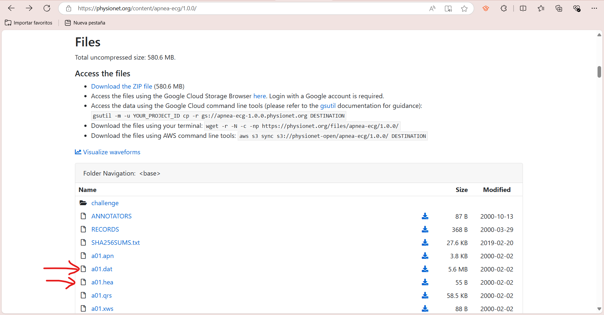
5. Despues de tener descargados los archivos de nuestra señal recuerde que es necesario que estos sean guardados en la misma carpeta en que se guarde nuestro proyecto en python.
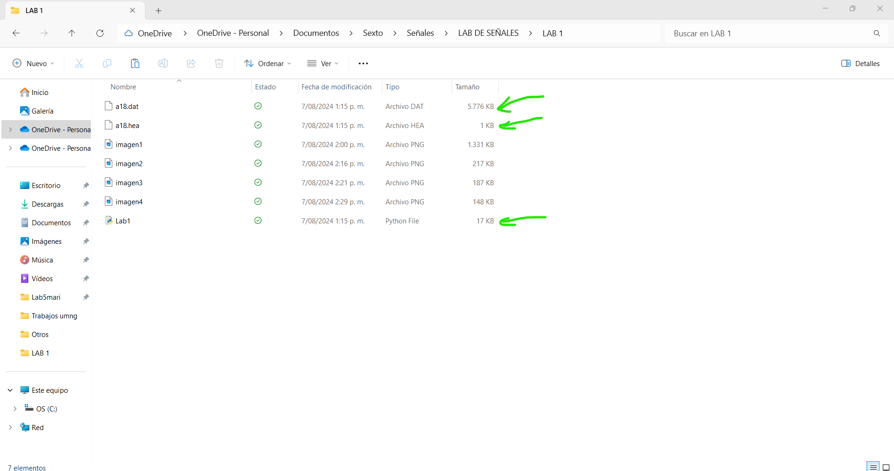

<a name="librerias"></a> 
## Librerias 

Al ingresar a nuestro archivo en Python, lo primero que debemos realizar es la instalacion de las librerias que vamos a utilizar, estos paquetes son esenciales para realizar diversas tareas como la lectura de datos, cálculos numéricos, estadísticas y visualización de datos, este proyecto se realizo en Anaconda, esto significa que por defecto ya se tenian instaladas la mayoria. La unica libreria que se debe instalar es "wfdb" que es una biblioteca de herramientas para leer, escribir y procesar señales y anotaciones de WFDB, sin esta no seria posible utilizar la señal descargada en Physionet. Para descargarla unicamente nos dirigimos a la consola y escribimos "pip install wfdb".

```c
# Importar paquetes necesarios
import wfdb  # Para leer "records" de PhysioNet
import matplotlib.pyplot as plt  # Para graficar los datos
import numpy as np  # Para cálculos numéricos
import math  # Para cálculos matemáticos
from scipy.stats import variation  # Para calcular el coeficiente de variación
import seaborn as sns
```

<a name="señal2"></a> 
## ¿Como colocar la señal en pyhton?

Se utiliza la libreria wfdb para poder acoplar el archivo de datos de la señal y convertirlos en un vector, de esta manera que puedan ser utilizados para cada uno de los parametros a realizarse en la practica.

```c
# Cargar la información desde los archivos .dat y .hea
# Esto carga un record de ECG de PhysioNet con las señales asociadas
signal = wfdb.rdrecord('a18')

# Obtener los valores de la señal
valores = signal.p_signal  # p_signal es un array numpy con las señales
valoresreducido = valores.flatten()[:500]  # Reducir a las primeras 500 muestras para algunas gráficas
valoresreducido2 = valores.flatten()[:100]  # Reducir aún más para otras gráficas

# Obtener el número de muestras
tamano = signal.sig_len  # sig_len es la longitud de la señal

```

<a name="estadisticos"></a> 
## Estadisticos Descriptivos 

Un estadístico descriptivo es una medida que resume o describe las características de un conjunto de datos. Ejemplos comunes incluyen la media, la mediana, la moda, la desviación estándar y el rango. Estas estadísticas ayudan a entender la distribución y la variabilidad de los datos sin hacer inferencias más amplias.

Para este practica, en el momento de realizar los estadisticos de prueba se realizaron de 2 maneras, con sus respectivas formulas estadisticas, haciendo cada parte de esta por individual y con sus correspondientes funciones en python.

1. Sacamos el tamaño de nuestra señal, este sera utilizado para poder realizar los calculos de los estadisticos descriptivos.

```c
# Obtener el número de muestras
tamano = signal.sig_len  # sig_len es la longitud de la señal
```
2. Usando las siguientes formulas relizaremos los estadisticos descriptivos de forma "Manuel" y a us vez utilizaremos las funciones para scaralos comn python.
- Media: Es un valor central característico de un conjunto de datos estadísticos. Para calcular la media aritmética se suman todos los valores y se divide entre el número total de datos.
- Desviacion estandar: Es un valor que indica la dispersión de un conjunto de datos estadísticos. Es igual a la raíz cuadrada de la suma de los cuadrados de las desviaciones de la serie de datos partido por el número total de observaciones.
- Coeficiente de variacion: Es una medida estadística que sirve para determinar la dispersión de un conjunto de datos respecto a su media. Se calcula dividiendo la desviación típica de los datos entre su promedio.
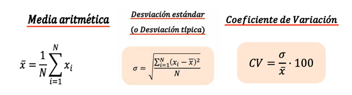

```c
# Definir función para calcular valores estadísticos
def valores_estadisticos():
    print("Tamaño del vector de la señal:", tamano)
    print("Valores de la matriz", valores)

    # MEDIA CON CÁLCULOS A MANO
    suma_vector = sum(valores)  # Sumar todos los valores de la señal
    media = suma_vector / tamano  # Calcular la media dividiendo por el número de muestras
    print('Media manual:', media)

    # MEDIA CON FUNCIONES DE PYTHON
    media_python = np.mean(valores)  # Usar numpy para calcular la media
    print('Media con python:', media_python)

    # DESVIACIÓN ESTÁNDAR A MANO
    sumatoria = 0.0  # Inicializar la sumatoria para la desviación estándar
    for valor in valores:
        sumatoria += (valor - media) ** 2  # Sumar el cuadrado de la diferencia de cada valor con la media
    varianza = sumatoria / tamano  # Calcular la varianza dividiendo por el número de muestras
    desviacion = math.sqrt(varianza)  # Calcular la desviación estándar tomando la raíz cuadrada de la varianza
    print('Desviación estándar manual:', desviacion)

    # DESVIACIÓN ESTÁNDAR CON FUNCIONES DE PYTHON
    desviacion_python = np.std(valores, ddof=1)  # Usar numpy para calcular la desviación estándar (ddof=1 para muestras)
    print('Desviación estándar con python:', desviacion_python)

    # COEFICIENTE DE VARIACIÓN A MANO
    coeficiente = (desviacion / media) * 100  # Calcular el coeficiente de variación como la desviación estándar dividida por la media
    print('Coeficiente de variación manual:', coeficiente, '%')

    # COEFICIENTE DE VARIACIÓN CON FUNCIONES DE PYTHON
    coeficiente_variacion = variation(valores) * 100  # Usar scipy.stats para calcular el coeficiente de variación
    print('Coeficiente de variación con python:', coeficiente_variacion, '%')
```
<a name="histograma"></a> 
## Histogramas

1. Grafica los valores de la señal original y muestra la potencia de la señal. Debemos tner en cuenta que esta potencia la utilizaremos mas adelante.

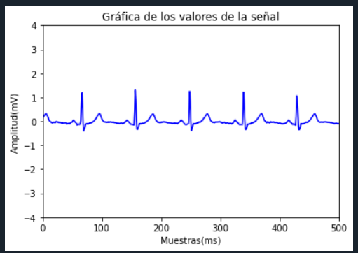
```c
# Calcular la potencia de la señal
for a in valores:
    sumatoriavalores += (a)**2  # Sumar el cuadrado de cada valor para obtener la potencia
potenciasenal = sumatoriavalores / tamano  # Dividir por el número de muestras para obtener la potencia promedio
# Definir función para graficar la señal original
def señal():   
    plt.plot(valores, color='blue')  # Graficar los valores de la señal en azul
    plt.title('Gráfica de los valores de la señal')  # Título de la gráfica
    plt.xlabel('Muestras(ms)')  # Etiqueta del eje x
    plt.ylabel('Amplitud(mV)')  # Etiqueta del eje y
    plt.xlim(0, 500)  # Limitar el eje x para mostrar solo las primeras 500 muestras
    plt.ylim(-4, 4)  # Limitar el eje y para que todas las gráficas tengan la misma escala
    plt.show()  # Mostrar la gráfica
    print("POTENCIA SEÑAL ELEGIDA", potenciasenal)  # Imprimir la potencia de la señal
```

2. Esta función calcula y muestra el histograma de los datos, tanto manualmente como usando funciones de Python. Para la realizacion

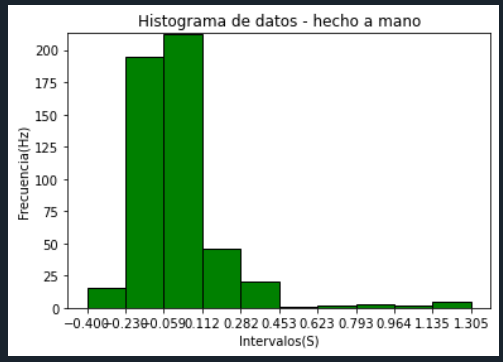

- Histograma Manual: SE hace dividiendo los datos en intervalos (bins) que desea usar y calculando el rango de cada uno y contabilizando la frecuencia de los datos en cada intervalo, cuántos datos caen dentro. Por otro lado tamnbien se determina el rango de los datos con valor mínimo y el valor máximo se calculae el ancho de cada intervalo dividiendo el rango de los datos por el número de intervalos y se generan los límites de los mismos, por ultimo se contabiliza la frecuencia de los datos en cada intervalo.
```c
   if menu ==1:
            plt.bar(intervalos[:-1], frecuencias, width=ancho_intervalo,color='green', edgecolor='black', align='edge')  # Crear el histograma
            plt.title('Histograma de datos - hecho a mano')  # Título de la gráfica
            plt.xlabel('Intervalos(S)')  # Etiqueta del eje x
            plt.ylabel('Frecuencia(Hz)')  # Etiqueta del eje y
            plt.xticks(intervalos)  # Establecer los ticks en los intervalos
            plt.ylim(0, max(frecuencias) + 1)  # Ajustar el límite del eje y para asegurar que todas las gráficas tengan la misma escala
            plt.show()  # Mostrar el histograma
```
- Histograma en python:

La función de probabilidad, representada por la línea roja sobre el histograma, proporciona una estimación suavizada de la densidad de probabilidad de los datos. Esta línea muestra claramente un pico muy pronunciado alrededor del 0, lo cual sugiere que los valores cercanos a 0 son los más comunes en el conjunto de datos. La densidad de probabilidad disminuye de manera más gradual a medida que nos alejamos del punto central.

En cuanto a la distribución, el histograma sugiere que los datos podrían seguir una distribución normal o gaussiana. La mayoría de los datos se encuentran en el rango de aproximadamente -0.5 a 0.5, lo que indica una desviación estándar pequeña. Esta concentración alrededor del valor central y la forma simétrica de la distribución apoyan la hipótesis de una distribución normal.

Sin embargo, se observa un ligero sesgo positivo en la distribución. Aunque la mayoría de los datos se concentran en 0, hay una pequeña cola extendiéndose hacia la derecha, lo que indica la presencia de valores atípicos significativamente mayores que el resto de los datos. Esta asimetría en la distribución señala que los datos no son perfectamente simétricos.

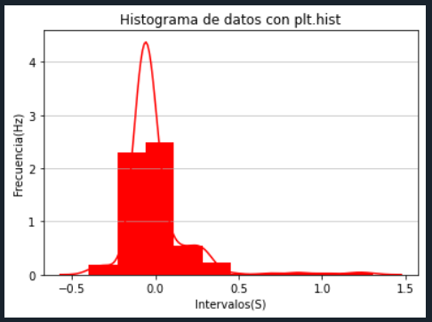
```c
 if menu ==2:
            ax = sns.distplot(valoresreducido,
                  kde = True,            
                  bins=numero_intervalos,
                  color='red',
                  hist_kws={"linewidth": 200,'alpha':1})
            ax.set(xlabel='Normal Distribution', ylabel='Frequency')
            plt.title('Histograma de datos con plt.hist')
            plt.xlabel('Intervalos(S)')
            plt.ylabel('Frecuencia(Hz)')
            plt.grid(axis='y', alpha=0.75)
            plt.show()
```

<a name="ruido1"></a> 
## Ruido Gaussiano
1. Contaminación con ruido gaussiano
```c
# Contaminación con ruido gaussiano
N = 500  # Número de muestras a simular, se puede elegir cualquier número
sumatoriavalores = 0.0  # Inicializar la sumatoria de los valores de la señal
```
2. Definir función para agregar ruido gaussiano normal y normalizado.
```c
# Definir función para agregar ruido gaussiano y graficar
def ruido_gaussiano():
    ruidogaussiano = np.random.randn(N)  # Generar ruido gaussiano (distribución normal estándar)
    ruido1normalizado = ((ruidogaussiano * 0.3) / 4)  # Normalizar el ruido
    snrneg = 10.0 * np.log10(potenciasenal / np.var(ruidogaussiano))  # Calcular el SNR para el ruido sin normalizar
    snrpos = 10.0 * np.log10(potenciasenal / np.var(ruido1normalizado))  # Calcular el SNR para el ruido normalizado

    menu = 0
    while menu != 5:
        # Mostrar el menú de opciones
        print("1. Ruido sin normalizar\n2. Ruido normalizado\n3. Señal + ruido normalizado\n4. Señal + ruido sin normalizar\n5. Volver")
        menu = int(input("Elige una opción:"))
        if menu == 1:
            plt.plot(ruidogaussiano, color='red')  # Graficar ruido gaussiano sin normalizar
            plt.title("Ruido Gaussiano Sin Normalizar")  # Título de la gráfica
            plt.xlabel('Muestras(ms)')  # Etiqueta del eje x
            plt.ylabel('Amplitud(mV)')  # Etiqueta del eje y
            plt.xlim(0, 500)  # Limitar el eje x
            plt.ylim(-4, 4)  # Limitar el eje y
            plt.show()  # Mostrar la gráfica
        if menu == 2:
            plt.plot(ruido1normalizado, color='orange')  # Graficar ruido gaussiano normalizado
            plt.title("Ruido Gaussiano Normalizado")  # Título de la gráfica
            plt.xlabel('Muestras(ms)')  # Etiqueta del eje x
            plt.ylabel('Amplitud(mV)')  # Etiqueta del eje y
            plt.xlim(0, 500)  # Limitar el eje x
            plt.ylim(-4, 4)  # Limitar el eje y
            plt.show()  # Mostrar la gráfica
```
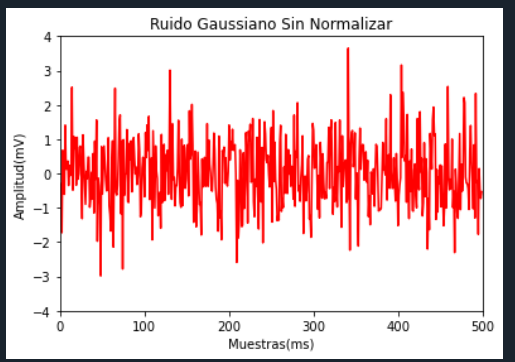
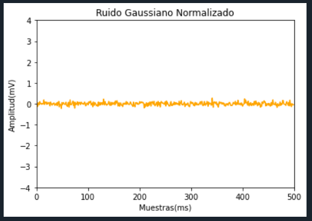

Por otro lado en el codigo tambien se puede evidenciar que se saco la potencia para el ruido y el SNR. RECORDAR QUE ESTE PROCESO SE REALIZARA PARA CADA UNO DE LOS RUIDOS.

- Potencia:
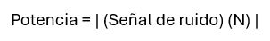
- SNR:
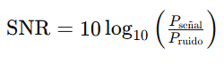
3. Graficar ruido + señal normalizado y sacar los valores del SNR.
  ```c
  if menu == 3:
            senal_ruido1normal = valoresreducido + ruido1normalizado  # Sumar la señal original con el ruido normalizado
            plt.plot(senal_ruido1normal, color='purple')  # Graficar la señal con ruido normalizado
            plt.xlabel('Muestras(ms)')  # Etiqueta del eje x
            plt.ylabel('Amplitud(mV)')  # Etiqueta del eje y
            plt.title("Señal + Ruido Gaussiano Normalizado")  # Título de la gráfica
            plt.xlim(0, 500)  # Limitar el eje x
            plt.ylim(-4, 4)  # Limitar el eje y
            plt.show()  # Mostrar la gráfica
            print("SNR positivo:", snrpos)  # Imprimir el SNR para el ruido normalizado
        if menu == 4:
            senal_ruidogauss = valoresreducido + ruidogaussiano  # Sumar la señal original con el ruido sin normalizar
            plt.plot(senal_ruidogauss, color='brown')  # Graficar la señal con ruido sin normalizar
            plt.xlabel('Muestras(ms)')  # Etiqueta del eje x
            plt.ylabel('Amplitud(mV)')  # Etiqueta del eje y
            plt.title("Señal + Ruido Gaussiano Sin Normalizar")  # Título de la gráfica
            plt.xlim(0, 500)  # Limitar el eje x
            plt.ylim(-4, 4)  # Limitar el eje y
            plt.show()  # Mostrar la gráfica
            print("SNR negativo:", snrneg)  # Imprimir el SNR para el ruido sin normalizar
  ```
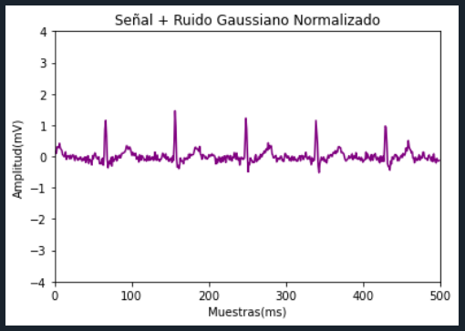
SNR positivo: [7.88522954], la señal deseada es más fuerte que el ruido que la acompaña.

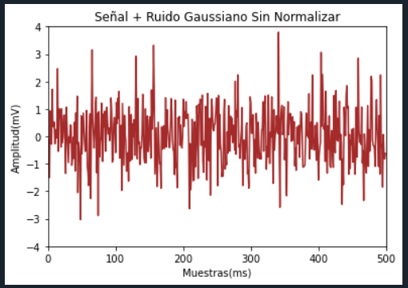
SNR negativo: [-14.6135452], indica que la potencia del ruido es mayor que la potencia de la señal.

<a name="ruido2"></a> 
## Ruido Impulso

Para este rudio se realizara el mismo procedimiento que en el anterior.
```c
# Definir función para agregar ruido de impulso y graficar
def ruido_impulso():
    n = np.linspace(0, 30, 500)
    ruidoimpulso = np.abs(np.random.randn(N))
    ruido2normalizado = (ruidoimpulso * 0.3 / 4)
    señalsumada3 = ruido2normalizado + valoresreducido
    snrneg2 = 10.0 * np.log10(potenciasenal / np.var(ruidoimpulso))
    snrpos2 = 10.0 * np.log10(potenciasenal / np.var(ruido2normalizado))
    menu = 0
    while menu != 5:
        print("1. Ruido sin normalizar\n2. Ruido normalizado\n3. Señal + ruido normalizado\n4. Señal + ruido sin normalizar\n5. Volver")
        menu = int(input("Elige una opción:"))
        if menu == 1:
            plt.xlabel('Muestras(ms)')  # Etiqueta del eje x
            plt.ylabel('Amplitud(mV)')  # Etiqueta del eje y
            plt.stem(n, ruidoimpulso, linefmt='C0-', markerfmt='C0o', basefmt='C0-')
            plt.title("Ruido de Impulso Sin Normalizar")
            plt.xlim(0, 30)
            plt.ylim(-4, 4)
            plt.show()
        if menu == 2:
            plt.xlabel('Muestras(ms)')  # Etiqueta del eje x
            plt.ylabel('Amplitud(mV)')  # Etiqueta del eje y
            plt.plot(ruido2normalizado, color='cyan')
            plt.title("Ruido de Impulso Normalizado")
            plt.xlim(0, 500)
            plt.ylim(-4, 4)
            plt.show()
        if menu == 3:
            plt.xlabel('Muestras(ms)')  # Etiqueta del eje x
            plt.ylabel('Amplitud(mV)')  # Etiqueta del eje y
            plt.plot(señalsumada3, color='magenta')
            plt.title("Señal + Ruido de Impulso Normalizado")
            plt.xlim(0, 500)
            plt.ylim(-4, 4)
            plt.show()
            print("SNR 2 positivo:", snrpos2)
        if menu == 4:
            plt.xlabel('Muestras(ms)')  # Etiqueta del eje x
            plt.ylabel('Amplitud(mV)')  # Etiqueta del eje y
            señalsumada2 = ruidoimpulso + valoresreducido
            plt.plot(señalsumada2, color='lime')
            plt.title("Señal + Ruido de Impulso Sin Normalizar")  # Título de la gráfica
            plt.xlim(0, 500)  # Limitar el eje x
            plt.ylim(-4, 4)  # Limitar el eje y
            plt.show()  # Mostrar la gráfica
            print("SNR 2 negativo:", snrneg2)
        if menu == 5:
            break  # Salir del menú
        if menu > 5 or menu < 1:
            print("Opción inválida")  # Manejar opciones inválidas
```
- Ruido normal:
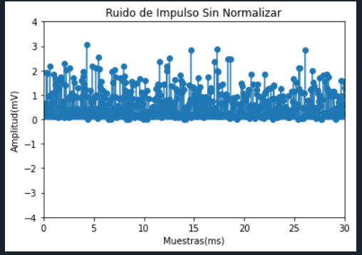
- Ruido normalizado:
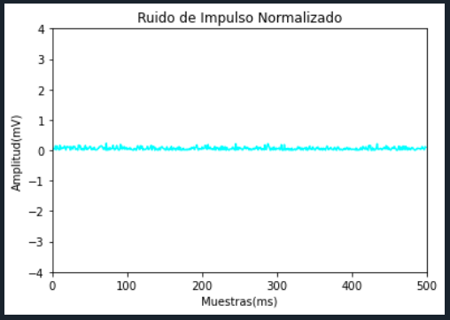
- Ruido normalizado+señal:
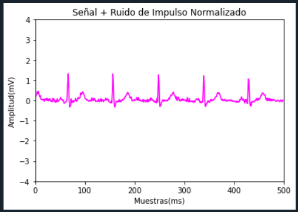
SNR 2 positivo: [12.14414016], la señal deseada es más fuerte que el ruido que la acompaña.
- Ruido sin normalizado+señal:
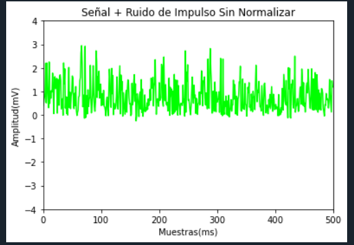
SNR 2 negativo: [-10.35463457], indica que la potencia del ruido es mayor que la potencia de la señal.

<a name="ruido3"></a> 
## Ruido tipo artefacto

Para este rudio se realizara el mismo procedimiento que en el anterior.
```c
def ruido_artefacto():
    print("¿Qué tipo de señal deseas ver?")
    
    # Generar ruido tipo artefacto
    num_artefactos = 100  # Número de artefactos a añadir
    amplitud_artefacto = 0.5  # Amplitud fija para cada artefacto
    indices_artefactos = np.random.randint(0, len(valoresreducido2), num_artefactos)  # Posiciones aleatorias de los artefactos
    artefactos = np.zeros_like(valoresreducido2)  # Crear un vector de ceros con la misma longitud que valoresreducido2
    artefactos[indices_artefactos] = amplitud_artefacto  # Colocar artefactos con la amplitud especificada en las posiciones aleatorias

    # Sumar la señal de artefactos a la señal original
    suma3 = valoresreducido2 + artefactos

    # Calcular la potencia del ruido tipo artefacto
    sumatoriaarte = 0.0
    for i in artefactos:    
        sumatoriaarte += (i)**2
    potenciaartefacto = sumatoriaarte / num_artefactos

    # Normalizar la señal de artefactos
    ruido3normalizado = (artefactos * 0.3) / 4
    sumatoriaarte2 = 0.0
    for i in ruido3normalizado:    
        sumatoriaarte2 += (i)**2
    potenciaartefactonormalizado = sumatoriaarte2 / num_artefactos

    # Sumar la señal original con la señal de artefactos normalizada
    señalsumada4 = ruido3normalizado + valoresreducido2

    # Calcular la relación señal-ruido (SNR)
    snrneg3 = 10.0 * np.log10(potenciasenal / potenciaartefacto)
    snrpos3 = 10.0 * np.log10(potenciasenal / potenciaartefactonormalizado)
```
- Ruido normal:
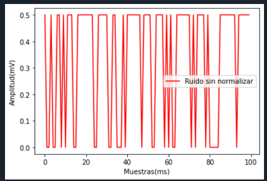
- Ruido normalizado:
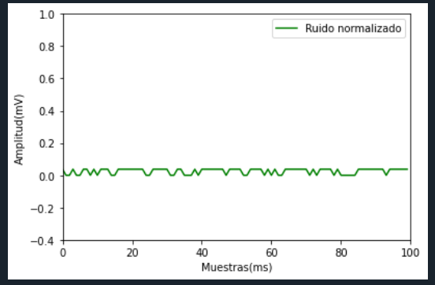
- Ruido normalizado+señal:
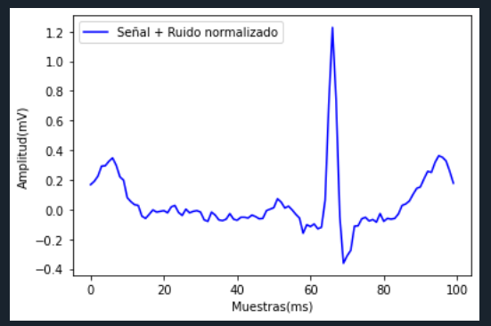
SNR positivo: [15.43804121], la señal deseada es más fuerte que el ruido que la acompaña.
- Ruido sin normalizado+señal:

SNR negativo: [-7.06073352], indica que la potencia del ruido es mayor que la potencia de la señal.

<a name="contacto"></a> 
## Contacto
* Creado por [Marianitex](https://github.com/Marianitex) - sígueme en mis redes sociales como @_mariana.higuera
