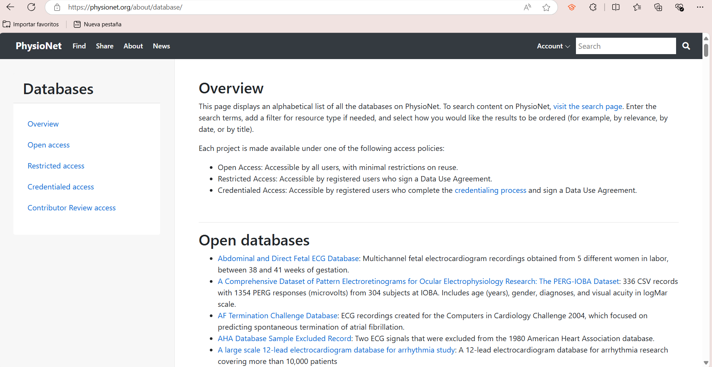
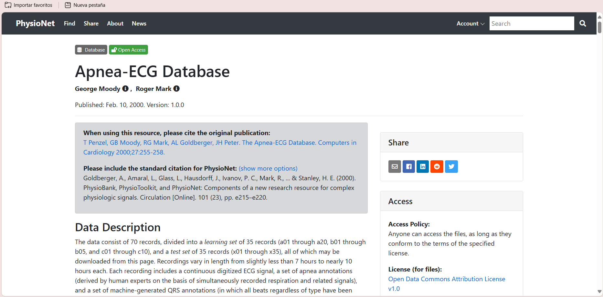

# Laboratorio-1-señales
>  Análisis estadístico de la señal 
---
Agosto 2024

## Tabla de contenidos
* [¿Qué se va a realizar?](#introduccion)
* [Señal en Physionet](#señal)
* [Estadisticos descriptivos](#estadisticos)
* [Histogramas](#histograma)
* [Ruido Gaussiano](#ruido1)
* [Ruido Impulso](#ruido2)
* [Ruido Tipo artefcato](#ruido3)
* [Contacto](#contacto)
---
 
## ¿Qué se va a realizar?
Las señales medidas de un entorno real, en este caso, las señales biomédicas están caracterizadas por contener información relevante, como amplitud y 
frecuencia e información que la contamina, denominada ruido.Adicionalmente, existe información que puede describir una señal biomédica a partir de variables estadísticas. Para esta práctica de laboratorio el estudiante deberá descargar una señal fisiológica y calcular los estadísticos que la describen, explicando para qué sirve cada uno.

1. Entrar a bases de datos de señales fisiológicas como physionet, buscar y descargar una señal fisiológica de libre elección. Tenga en cuenta que si por 
algún motivo no puede calcular todos los parámetros solicitados porque la señal es muy corta, deberá descargar una nueva señal.  
2. Importar la señal en python y graficarla. Para esto pueden hacer uso de cualquier compilador, como spyder, google colab, sistema operativo Linux, etc. Se 
recomienda utilizar la librería matplotlib para graficar en python. 
3. Calcular los estadísticos descriptivos de dos maneras diferentes cuando sea posible: la primera vez, programando las formulas desde cero; la segunda vez, 
haciendo uso de las funciones predefinidas de python.  
Los estadísticos que se espera obtener son:
- Media de la señal 
- Desviación estándar
- Coeficiente de variación 
- Histogramas 
- Función de probabilidad
5. Investigar qué es la relación señal ruido (SNR):
- Contaminar la señal con ruido gaussiano y medir el SNR 
- Contaminar la señal con ruido impulso y medir el SNR 
- Contaminar la señal con ruido tipo artefacto y medir el SNR

 
## Señal en Physionet
1. Buscar Physionet desde su navegador preferido y seleccionar el boton "DATA".

2. Al ingresar en "DATA" van a aparecer todos los archivos de señales que la pagina tiene en su repositorio, para este proyecto el seleccionado fue "Apnea-ECG Database: Seventy ECG signals with expert-labelled apnea annotations and machine-generated QRS annotations".

2. Al ingresar a la señal seleccionada podremos evidenciar toda la informacion que nos comunica sobre que se trata la misma.

